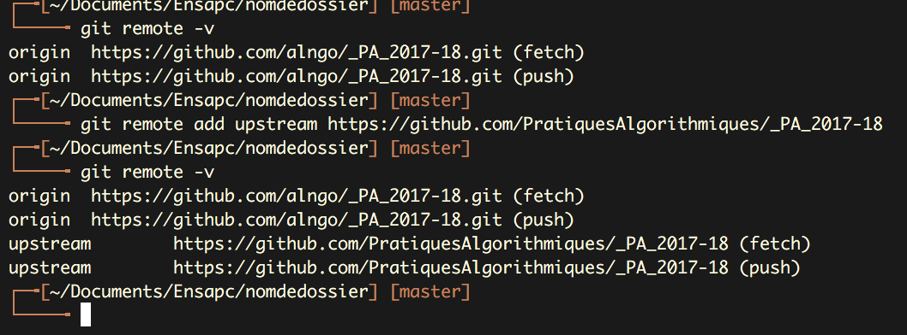
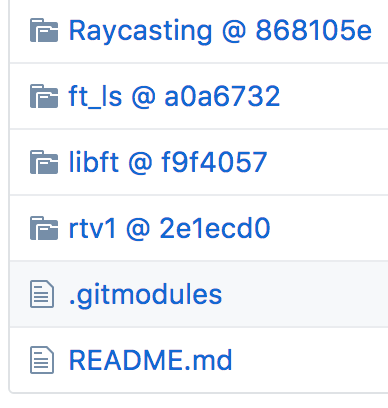

# Sommaire
1. [Introduction](#introduction)
2. [La console](#console)
  1. [Commande de la console](#cmdconsole)
3. [Git de base](#basique)
  1. [Routine git](#routine)
4. [Github](#github)
  1. [Independant](#inde)
  2. [Fork](#fork)
    1. [Pull request](#pullrequest)
  3. [Gestion de conflit](#conflit)
5. [Branche](#branche)
6. [Sous-module](#submodule)
7. [Conclusion](#conclusion)


# Git, c'est magique ! <a name="introduction"></a>

Bonjour !

Je vais expliciter ici, les commandes et ce qu'il s'est passé durant le cours précédent. J'espère que vous comprendrez mieux, et je suis à votre disposition pour toutes vos questions :D

  * **[Git](https://git-scm.com/)** est un _logiciel de gestion de version de fichier_. Il garde en mémoire l’ensemble des ajouts/retraits apportés à un ou plusieurs fichiers. La nature open-source et la légèreté d’utilisation de ce logiciel le rend très populaire dans le milieu du développement. Dans la pratique, ce logiciel permet d’éviter les duplicatas, de retrouver des anciennes versions. En gros, c’est de l’organisation potentielle.

  * **[GitHub](https://github.com/)** est une plateforme en ligne proposant un _service de stockage_. Son interface et ses restrictions sont basées sur “git”. Comme pour les ICloud, dropBox, GoogleDrive, il existe plusieurs plateforme de ce genre, par exemple Gitlab, Gitbucket... Une porte ouverte à la collaboration, à l’indépendance vis à vis du poste de travail.

Dans le cadre de Pratique Algorithmique, nous utilisons **Github**. Un "**[repository](https://github.com/PratiquesAlgorithmiques/_PA_2017-18)**" existe déjà. :)

Un **repository** (surnommé **"Repo"**) est une zone de stockage réservée sur les serveurs de **Github**.

Nous avons donc d’une part un logiciel et d’autre part une plateforme de stockage.

Pour les utilisateurs de windows, je conseille d'installer **[git bash](https://git-for-windows.github.io/)**.
Cela permet de partager un vocabulaire commun entre mac et pc si vous utilisez la console.

## La console... <a name="console"></a>

  >...c'est une grosse boite dans laquelle tu peux entrer des formules magiques permettant d'effectuer des actions.

  >...une boite de texte ou tu peux entrer des commandes qui affichent ses résultats uniquement en texte.
  
  >...C'est une façon de parler à l'ordinateur pour lui demander d'effectuer des actions.

De base, elle ressemble à ça :


Elle est proche du système et elle est très puissante !

Il ne faut donc pas faire n'importe quoi avec et ne surtout pas recopier une commande trouvé sur internet sans la comprendre. Méfiez-vous des facétieux et surtout de la commande **rm** (pour *ReMove*, elle supprime définitivement ce qu'on lui passe en argument sans passer par la corbeille (0_0))!

## Petit lexique des formules magiques du terminal : <a name="cmdconsole"></a>

  * **pwd** : signifie *Print Working Directory*. Elle indique l'endroit où l'on se trouve dans l'architecture de dossier. Elle est très utile pour se repérer.

  * **ls** : pour *LiSt*. Utlisé sans option, elle permet de lister les fichiers et les dossiers à l'endroit où l'on se trouve. Avec l'option -a, les fichiers "cachés" sont aussi listé.

  * **cd** : *Change Directory*. Une fois que nous avons les outils pour se repérer dans l'architecture du systeme, nous pouvons nous déplacer ! **cd** nous amène vers le dossier indiqué en argument. **"cd .."** pour aller en arrière (".." signifie *dossier précédent* et "." *dossier actuel*) et un **"cd"** tout simple pour revenir au *"home"*, le point de depart. 


Pour toutes les commandes, il y a un manuel. Il suffit de taper **man** avant la commande et de lire le gros pavé. (ex: **"man ls"**)

(Et puis pour entrer une commande, il suffit de l'écrire et d'appuyer sur la touche "entrée".)

Voilà pour les commandes de base. \\(^-^)/

## Git tout simplement ! <a name="basique"></a>

Je parlerai ici des commandes pour une utilisation très basique de **Git**. Une utilisation avec une seule branche : la branche "master" en local, c'est à dire sur votre machine. Nous pouvons retrouver ses commandes sur sublime Text, elles font plus ou moins la même chose avec plus ou moins de souplesse.

 * **git init** : Initialise un dépot git, transforme un dossier normal en un dossier géré par le gestionnaire de version git. un ".git" va se greffer dans le dossier. Cette commande est a entrer dans le dossier que vous voulez transformer en dépot.
  
 * **git status** : Permet d'avoir un aperçu l'état du dépot.
   
   * *Les fichiers "untracked"* ne sont pas recensé dans le depot git. Ce dernier n'a donc aucune idée de ce qu'ils sont et ne possède pas d'historique pour ces derniers.
   
   * *Les fichiers "modified"* sont les fichiers recensés et modifiés entre le dernier "commit" (une photo) et l'état actuel non sauvagardé du dépot.
   
 
   
 * **git add** : Permet d'ajouter des *untracked* ou des *modified* sur le stage, c'est... comme prendre des objets et les installer sur une table dans le but de faire une photo. Nous pouvons dire que les fichiers prennent la pose.
 
 * **git commit** : cette commande permet de faire la photo. Elle enregistre l'état actuel du dépot sous la forme d'un "commit". Elle est à utiliser l'argument -m comme ceci :
 ```
 git commit -m "message blablabla"
 ```
 Le message entre guillemet accompagnera le commit toute sa vie ( ou presque :D ). Il est conseillé de faire des messages explicites. (ou pas)

  * **git log** : Affiche l'historique de tous les commits qu'il y a eu. Cette commande est très utile lorsque nous voulons revenir en arrière. (Pour en sortir, il faut appuyer sur la touche "q").
  
  <a name="routine"></a>
```
La routine d'initialisation :

-> Ouvrir votre console préférée (terminal, iterm, git bash, powershell...).
-> Aller dans le dossier avec 'cd' ou bien glisser/deposer le dossier dans la fenêtre de la console.
-> 'git init'.
-> 'git add' des fichiers. ( '*' permet de selectionner tous les fichiers dans le dossier actuel )
-> 'git commit -m "message du premier commit"'
-> et voilà, un petit dépot avec une premiere sauvegarde ! :)

Vous pouvez faire un 'git status' entre chaque étape. et un 'git log' a la fin.


La routine d'usage :

-> Effectuer des modifications, des ajouts et des changement dans le code jusqu'à satisfaction.
-> git add les fichiers modifiés.
-> git commit -m "message du commit".

```
  
## GitHub ! <a name="github"></a>

### Un repositery indépendant. <a name="inde"></a>

Maintenant que nous avons vu l'usage en local, nous allons voir comment réserver un espace sur github et les commandes pour l'associer à notre dépot (le dossier géré par git). Pour cela, il suffit de créer un nouveau repo sur Github, à l'aide de *"new repository"*.


Il faut ensuite lui donner un nom.

Le fichier README est un fichier texte dans lequel nous pouvons mettre ce que l'on souhaite. Il est souvent utilisé pour présenter le projet.

.gitignore permet de générer un fichier .gitignore. Celui çi va permettre d'ignorer certain type de fichier au moment de la commande **git add**.

Et vous pouvez ajouter une license si vous le souhaitez


Une fois ceci fait, il faut récupérer l'url du dépot. Et nous allons maintenant parler des commandes.


  * **git remote add origin [votre-url]** : permet de crée le lien entre votre dossier et le repository. **origin** est très important, c'est le mot clef pour désigner l'adresse/url principale, elle est comprise par git.
    * -> **git remote -v** vous montre les liens que vous avez crée. ("-v" pour *verbose*).
      * *(fetch)* c'est l'adresse  git va chercher les données.

      * *(push)* c'est l'adresse sur laquelle git vas "pousser" les élements.
    
 

  * **git pull** : Tirer ! Si vous avez initialisé votre repo avec un readme ou n'importe quel autre fichier, il va falloir pull pour vous mettre à jour. Git pull c'est la fusion de git fetch et de git merge.
  
```
git pull origin master
```
  * **git push** : Pousser ! Après avoir ajouté vos fichiers dans a l'aide de git add et de git commit, vous pouvez pousser vos fichiers sur le serveurs. La première fois, il faut indiquer le chemin.
  
```
git push --set-upstream origin master
```

```
La routine d'usage + push :

après un commit:
-> git push (de temps en temps, souvent à la fin de la journée :).

```

Maintenant, plus besoin de passer par wetransfer où autre système laborieux de partage de code, vous pouvez simplement indiquer l'url de votre dépot !

### Fork et Pull request. <a name="fork"></a>

Pour ceux qui veulent travailler sur le repo _PA_2017-18 directement. Il faut savoir que ce tutoriel est très basique et que des commandes comme **git rebase**, **git stash** vous seront utiles.

**"fork"**, c'est faire dériver le repo original vers un repo qui est nous est propre et que nous pouvons modifier à notre guise. Pour cela, rendez-vous sur [_PA_2017-18](https://github.com/PratiquesAlgorithmiques/_PA_2017-18) et cliquer sur le bouton *"fork"*. Un nouveau dépot sera crée à votre nom.


  * **git clone** : une commande très utile ! Elle permet de récuperer une copie exact d'un repository, plus besoin de passer par un .zip. Dans notre cas, nous cherchons à récuperer votre "url fork" (elle est reconnaissable car elle contient votre login), puis faire un git clone de celui ci à l'endroit où vous le souhaitez en ajoutant un nom de dossier si necessaire.


  * **git remote add upstream [url]** : De base, il n'y a qu'une adresse lié au dépot. Il n'a donc aucune idee des changememts effectué dans l'original et vous ne pouvez pas récuperer des mise à jours de l'original. Heureusement, grâce à cette commande et aux commandes suivantes, vous aller pouvoir suivre et garder votre dépot up to date. Elle ajoute un lien entre le dépot et le repo de Jeff. "upstream" est une habitude personelle, vous pouvez l'appeler comme bon vous semble.



  * **git fetch upstream** : Recupere les données de upstream (implicitement, il va chercher des données dans le repo indiqué)

  * **git merge upstream/master** : Fusionne upstream dans le master, les fichiers fusionnent et se mettent à jours. Cela engendre parfois des "conflits" de version.

  * **git pull upstream master** : c'est la fusion de "fetch et de merge".

##### Effectuer une pull request. <a name="pullrequest"></a>

Une fois vos modifications faites et satisfaite il vous faut **push** vos modifications sur le serveur.
Ensuite, rendez-vous sur votre page et appuyer sur le button


Vous pouvez voir différente option et si tout vas bien, une petit coche verte apparaitra. Il faut ensuite appuyer sur create pull-request. Vous pouvez écrire un petit message explicatif :)


D'un coté et de l'autre, il y a la possibilié de modifier les fichiers. Il faut une communication entre le master et le l'initiateur de la pull request c'est pourquoi une sorte de petit forum existe pour se décider.

### Gestion des conflits. <a name="conflit"></a>

Les conflits naissent lorsqu'il y a une difference dans un meme fichier et que l'on souhaite les fusionner.

Nous aurons alors ceci :

```
<<<< HEAD Début du conflit

Code version sur l'actuel

========== 

Code version 2

>>>>> Fin (id du commit)
```

Pour le résoudre, il faut effacer la partie que l'on ne souhaite pas garder ou d'effectuer les modifications nécessaires au bon fonctionnement du code et de commit le changement.
    
## Plusieurs versions, plusieurs branches ? <a name="branche"></a>

Maintenant que nous avons vu la base, nous pouvons nous interroger sur le workflow git. Souvent il est d'usage de ne pas coder sur la branche master et de créer des branches. J'imagine que dans notre cas, chaque branche pourrait représenter une version differente de notre projets.


  * **git branch** : Permet de voir les branches existantes en local mais aussi de voir sur quelle branche nous sommes.
    * **git branch [nomdelabranche]** : Crée une branche [nomdelabranche]
    * **git branch -av** : Permet de voir les branches en remote (sur le serveur) -a et le dernier commit associé -v

  * **git checkout** C'est le **cd**(change directory) de git. Il permet de revenir dans le temps. Mais dans notre cas, nous l'utiliserons pour changer de branche.
    * **git checkout [nomdelabranche]** : se déplace sur la branche [nomdelabranche]
    * **git checkout -b [nomdelabranche]** cree et de deplace sur la branche [nomdelabranche]


Il suffit ensuite de code comme d'habitude (add, commit) sur votre nouvelle branche ! Si vous souhaiter la pusher sur le serveur, il faudra lui indiquer le chemin pour que ce dernier comprenne que c'est une nouvelle branche !
```
git push origin [nomdelabranche]
```

## Les sous-modules <a name="submodule"></a>

Dans le cas ou vous voudriez mettre plusieurs dépot dans un depot. fragmenter les dépot et d'élaborer une architecture plus organisée.

Avoir plusieurs projets différents sur un seul dépot et pouvoir les récuperer individuelement ou tous ensemble.

  * **git submodule add [url] nomdumodule**
  


## Conclusion. <a name="conclusion"></a>

Je vous envoie vers les vidéos de Daniel Shiffman !

[Introduction](https://youtu.be/BCQHnlnPusY)
[Branches](https://youtu.be/oPpnCh7InLY)
[Fork and Pull-Request](https://youtu.be/_NrSWLQsDL4)
etc..

Il est vraiment cool ! ^-^
